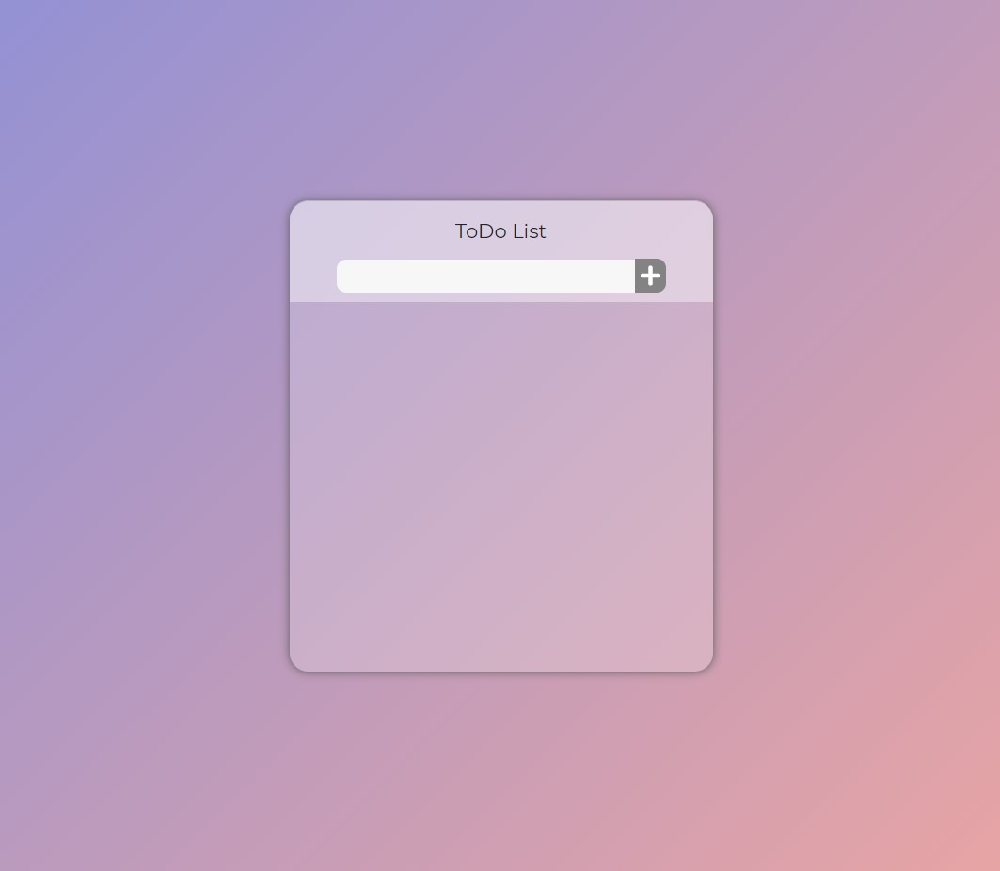
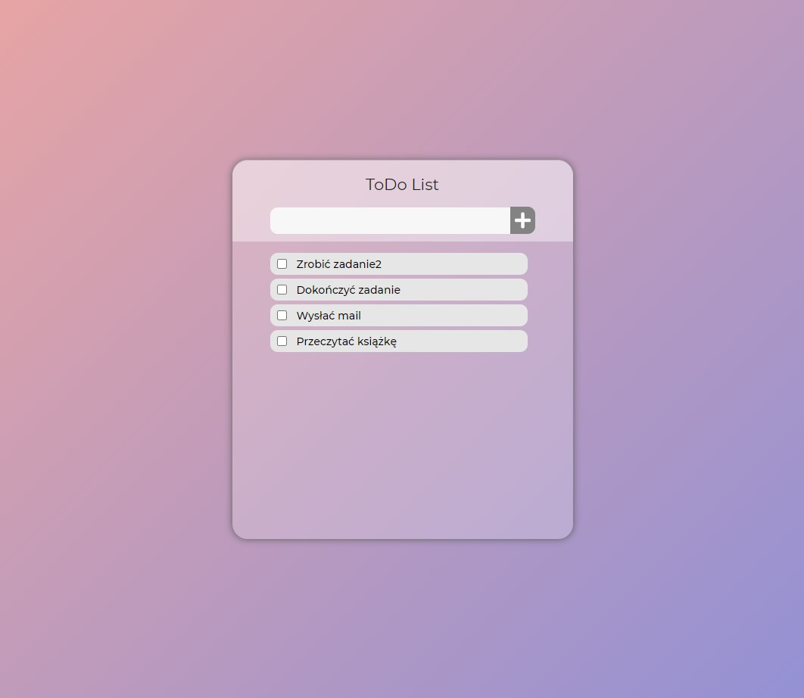
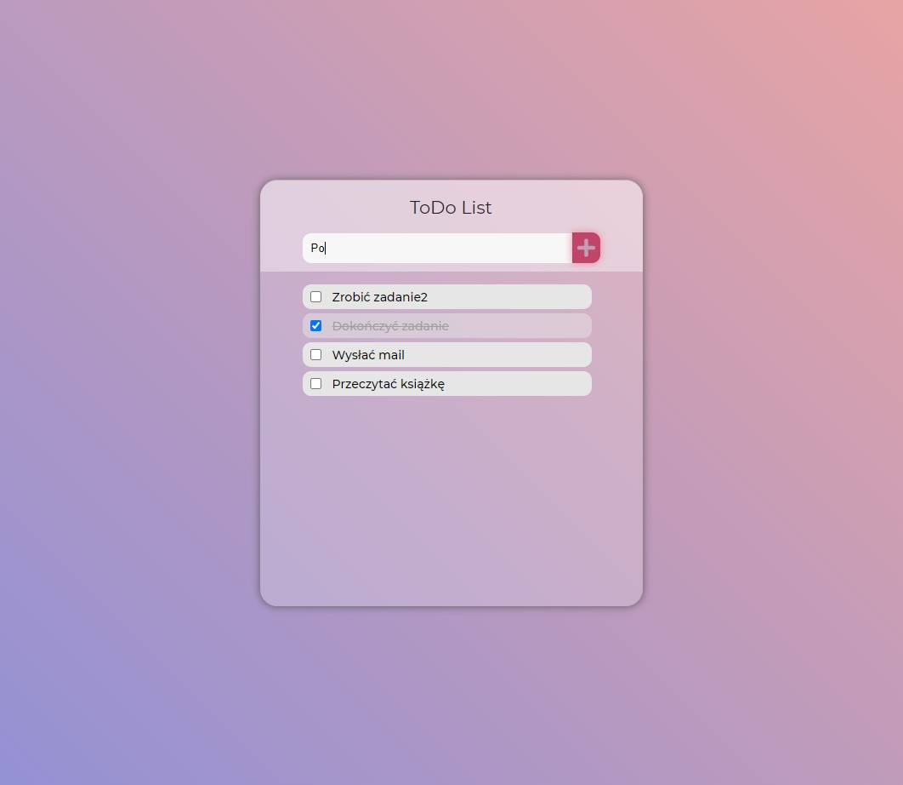
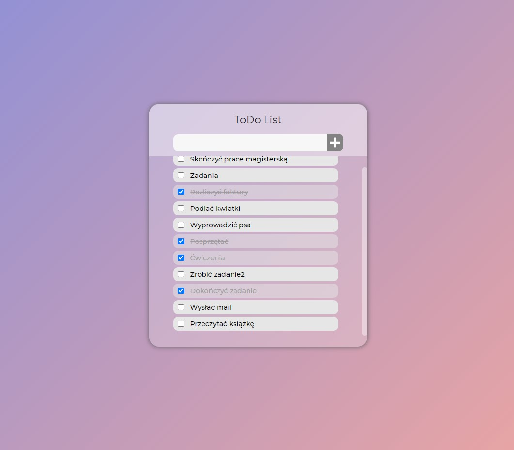

# TODO List
Web application using Laravel, Vue.js.
	
## Technologies
Project is created with:
* PHP 7.3
* Laravel Mix 6
* Vue.js
* XAMPP Apache server
	
## Installation
To run this project:

* Download project
* Put project folder inside htdocs folder (path is something like this C:\xampp\htdocs)
* Start MySQL and Apache server
* Go to the browser and type in URL field: localhost/ToDoList/index.php

